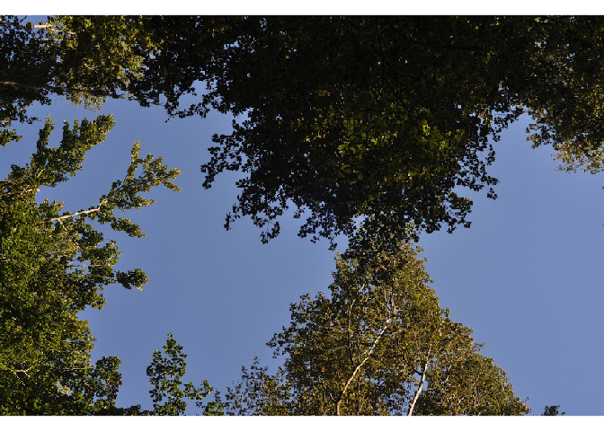
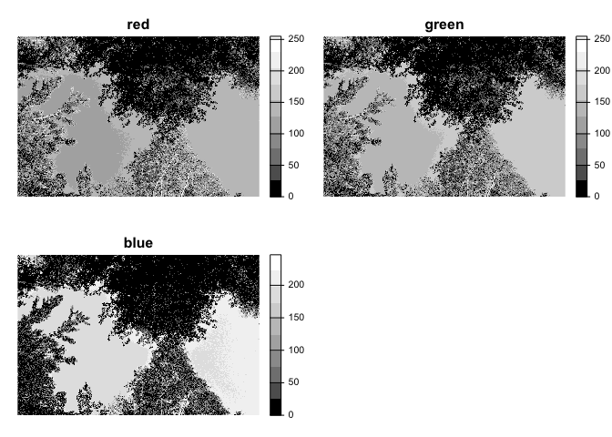
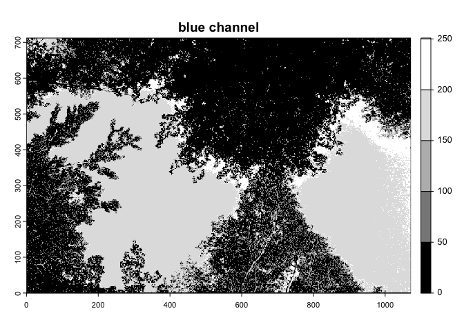
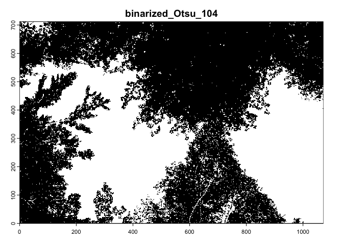
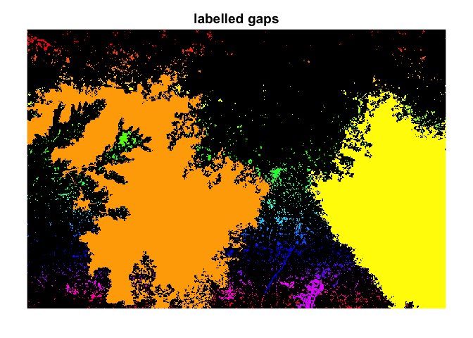
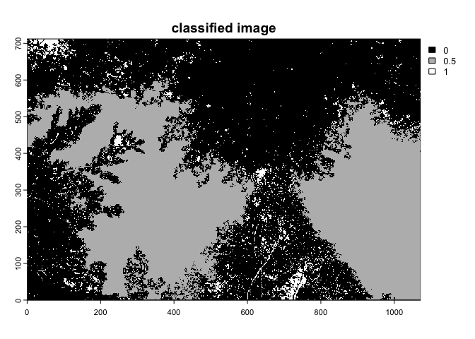

<!-- README.md is generated from README.Rmd. Please edit that file -->

# coverR2

<!-- badges: start -->
<!-- badges: end -->


Package `coveR2` allows to import, classify and analyze Digital Cover
Photography (DCP) images of tree canopies and export forest canopy
attributes like Foliage Cover and Leaf Area Index (LAI).

The DCP method was pioneered by [Macfarlane et
al. 2007a](https://www.sciencedirect.com/science/article/pii/S0168192306003376),
and it is based in acquiring upward-looking images of tree crowns using
a *normal* lens, namely a lens with a restricted (typically 30°) field
of view (FOV), although larger FOV images (e.g. those from camera traps
or smartphones) can be considered.  

The process of analyzing these images is substantially:  
1) import a cover image;  
2) create a binary image of canopy (0) and gaps (1);  
3) further classify gaps based on their size (large and small gaps);  
4) apply theoretical gap formulas to relate canopy structure to gap
fraction.  

# Installation

The `coveR2` package is a wrapper of the `coveR` ([Chianucci et
al. 2022](https://doi.org/10.1007/s00468-022-02338-5)) package which is
available only as development version
[here](https://gitlab.com/fchianucci/coveR). To make the package
available in CRAN, `coveR2` has not reading-EXIF functionality, which
avoids third-party software needs.

The `coveR2` can be installed from CRAN:

``` r
install.packages('coveR2')
```

A *development* version is available from
[GitLab](https://gitlab.com/fchianucci/coveR):

``` r
# install.packages("devtools")
devtools::install_gitlab("fchianucci/coveR2")
```

# Workflow

The basic steps of processing cover images are:

1.  import an image
2.  create a binary classification of gaps and canopy
3.  label each gap
4.  classify gaps based on their size
5.  retrieve canopy attributes from gap size

All these steps are performed by a single function `coveR2()`. The
following sections illustrate step-by-step the whole workflow required
to retrieve canopy attributes from DCP images.

## 1) Open an image and select the blue-channel.

First we need to import an RGB image:

``` r
library(coveR2)
image <- system.file('extdata','IMG1.JPG',package='coveR2')
```



The first step of the `coveR2` function allows to import the image as a
single-channel raster, using `terra::rast(band=x)` functionality. The
blue channel `coveR2(filename, channel=3`) is generally preferred as it
enables highest contrast between sky and canopy pixels, easing image
classification. This is well illustrated in the following figure:



We can then take the blue channel image using the `channel=3` argument:



The extra-argument `crop` allows to specify if some horizontal lines
should be removed from the bottom side of the image. This option is
useful when removing the *timestamp* from camera trap images. These data
are useful when the method is applied to continuous cameras, such as
camera traps, see [Chianucci et
al. (2021)](https://doi.org/10.1016/j.agrformet.2021.108516).

## 2) Classify and create a binary raster image.

Once imported, the functions uses the `thdmethod` argument to classify
the blue-channel pixels to get a binary image of sky (1) and canopy (0)
pixels. Note that the sky (hereafter gap) pixels are the target of
subsequent analyses.

`coveR2` function uses the `auto_thresh()` functionality of the
`autothresholdr` package ([Landini et
al. 2017](https://dx.doi.org//10.1111/jmi.12474)) to define an image
threshold. The default thresholding function used by `thd_blue` is
‘Otsu’. For other methods, see:
<https://imagej.net/plugins/auto-threshold>

After this steps, a single channel binary (0,1) SpatRaster is created,
which can be inspected with the `display` extra-argument:



## 3) Segment and create labelled gaps image.

Retrieving canopy attributes requires further classifying gap pixels
(those labelled as 1 in the binary raster image) as large,
between-crowns gaps and small, within-crown gaps. The function use the
`ConnCompLabel` functionality of `mcg` package
(<https://cran.r-project.org/package=mgc>) to assign a numeric label to
each distinct gap.

The function returns a single-channel raster image with each gap with a
numeric unique label:



Once labelled, each gaps can be classified based on their size.

## 4) Classify gaps based on their size.

There are basically two methods to classify gaps based on their (pixel)
size. A very effective method is the one proposed by [Macfarlane et
al. 2007b](https://www.sciencedirect.com/science/article/pii/S0168192307001177)
which consider large gaps (gL) those larger 1.3% of the image area (this
value can be varied in the `thd` argument). It can be selected via the
`gapmethod='macfarlane'` argument.

Alternatively, we can use the large gap method proposed by [Alivernini
et al. 2018](https://doi.org/10.1007/s00468-018-1666-3) which is based
on the statistical distribution of gap size inside images. In this
method large gaps (gL) are considers as:
$gL \ge \mu + \sqrt{{\sigma \over n}}$. Compared with the other method,
this is canopy-density dependent, as the large gap threshold varied with
the actual canopy considered. It can be selected via the
`gapmethod='alivernini'` argument.

    #>   Var1   Freq     id     NR        gL
    #> 1    0 432282 IMG1_3 763264    Canopy
    #> 2    1      1 IMG1_3 763264 Small_gap
    #> 3    2    319 IMG1_3 763264 Small_gap
    #> 4    3   1768 IMG1_3 763264 Small_gap
    #> 5    4     12 IMG1_3 763264 Small_gap
    #> 6    5      1 IMG1_3 763264 Small_gap

The function returns a dataframe of classified pixels into ‘Canopy’,
‘Small_gap’ and ‘Large_gap’ classes. ‘Var1’\>0 identify each gap region,
‘Freq’ is the number of pixels in each gap, while ‘NR’ is the image
size.

## 5) Retrieving canopy attributes from classified gap and canopy pixels

Once we classified gaps into large and small gaps using one of the two
methods above, the `coveR` function estimates canopy attributes from the
following modified Beer-Lambert law equations [Macfarlane et
al. 2007a](https://www.sciencedirect.com/science/article/pii/S0168192306003376).
The inversion for leaf area requires parametrizing an extinction
coefficient *k*, which is by default set to 0.5 (spherical leaf angle
distribution):

- Gap fraction (GF) is calculated as the fraction of gap pixels (those
  labelled as 1 in the binary image):

  $$
  GF= {gT \over NR}
  $$

  where $gT$ is the number of gap pixels, $NR$ is the total number of
  image pixels.;

- Foliage Cover (FC) is the complement of gap fraction:

  $$
  FC= 1-GF
  $$

- Crown Cover (CC) is calculated as the complement of large gap
  fraction:

  $$CC= 1-{gL \over NR}$$, where $gL$ is the number of large gap pixels,
  $NR$ is the total number of image pixels;

- Crown Porosity (CP) is calculated as the fraction of gaps within crown
  envelopes:

$$
CP=1- {FC \over CC}
$$

By knowing these canopy attributes, it is possible to derive effective
LAI (Le) as:

$$
Le= {-log(GF) \over k}
$$

- The actual LAI (L) is calculated as:

$$
L=-CC {log(CP) \over k}
$$

As the actual LAI considers clumping effects, $L \ge Le$.

- the Clumping Index (CI) is calculated as:

$$
CI = {Le \over L}
$$

    #> # A tibble: 1 × 12
    #>   id          FC    CC     CP    Le     L    CI     k imgchannel gapmethod 
    #>   <chr>    <dbl> <dbl>  <dbl> <dbl> <dbl> <dbl> <dbl>      <dbl> <chr>     
    #> 1 IMG1.JPG 0.565 0.604 0.0646 0.980  1.95 0.503  0.85          3 macfarlane
    #> # ℹ 2 more variables: imgmethod <chr>, thd <dbl>

## 6) Export the classified image

We can export the raster image with classified gap sizes using the
`export.image` argument function.



# More about

The functions are optimized to batch processing bunches of DCP images.
In such a case, you can use ‘traditional’ looping through images, as in
example below.

``` r
data_path<-system.file('extdata',package='coveR2')
files<-dir(data_path,pattern='jpeg$|JPG$', full.names = T)

res<-NULL
for (i in 1:length(files)){
  cv<-coveR2(files[i], display=F, message=F)
  res<-rbind(res,cv)
}

res
#> # A tibble: 2 × 12
#>   id          FC    CC     CP    Le     L    CI     k imgchannel gapmethod 
#>   <chr>    <dbl> <dbl>  <dbl> <dbl> <dbl> <dbl> <dbl>      <dbl> <chr>     
#> 1 IMG1.JPG 0.565 0.604 0.0646  1.67  3.31 0.503   0.5          3 macfarlane
#> 2 IMG3.JPG 0.711 0.777 0.0847  2.48  3.83 0.647   0.5          3 macfarlane
#> # ℹ 2 more variables: imgmethod <chr>, thd <dbl>
```

# References

Alivernini, A., Fares, S., Ferrara, C. and Chianucci, F., 2018. An
objective image analysis method for estimation of canopy attributes from
digital cover photography. *Trees*, *32*, pp.713-723.
<https://doi.org/10.1007/s00468-018-1666-3>

Chianucci, F., Bajocco, S. and Ferrara, C., 2021. Continuous
observations of forest canopy structure using low-cost digital camera
traps. *Agricultural and Forest Meteorology*, *307*, p.108516.
<https://doi.org/10.1016/j.agrformet.2021.108516>

Chianucci, F., Ferrara, C. and Puletti, N., 2022. coveR: an R package
for processing digital cover photography images to retrieve forest
canopy attributes. *Trees*, *36*(6), pp.1933-1942.
<https://doi.org/10.1007/s00468-022-02338-5>

Landini, G., Randell, D.A., Fouad, S. and Galton, A., 2017. Automatic
thresholding from the gradients of region boundaries. Journal of
microscopy, 265(2), pp.185-195. <https://doi.org/10.1111/jmi.12474>

Macfarlane, C., Hoffman, M., Eamus, D., Kerp, N., Higginson, S.,
McMurtrie, R. and Adams, M., 2007a. Estimation of leaf area index in
eucalypt forest using digital photography. *Agricultural and forest
meteorology*, *143*(3-4), pp.176-188.
<https://doi.org/10.1016/j.agrformet.2006.10.013>

Macfarlane, C., Grigg, A. and Evangelista, C., 2007b. Estimating forest
leaf area using cover and fullframe fisheye photography: thinking inside
the circle. *Agricultural and Forest Meteorology*, *146*(1-2), pp.1-12.
<https://doi.org/10.1016/j.agrformet.2007.05.001>
